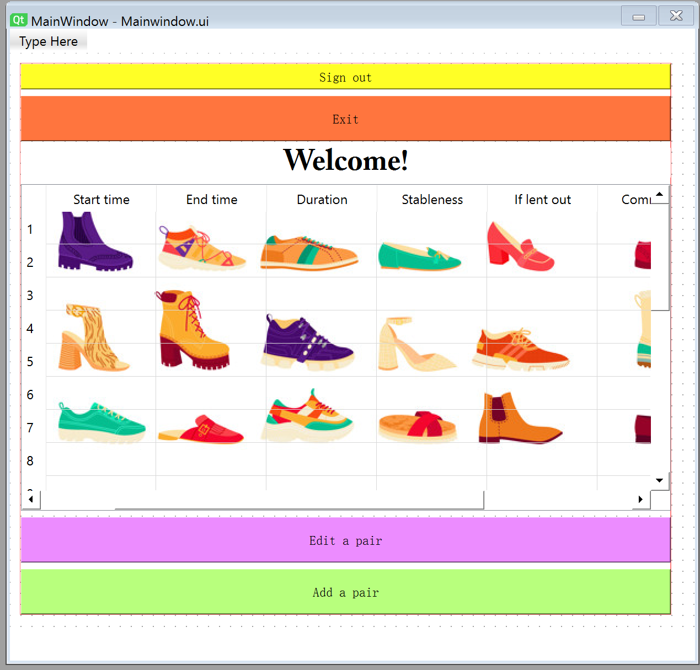
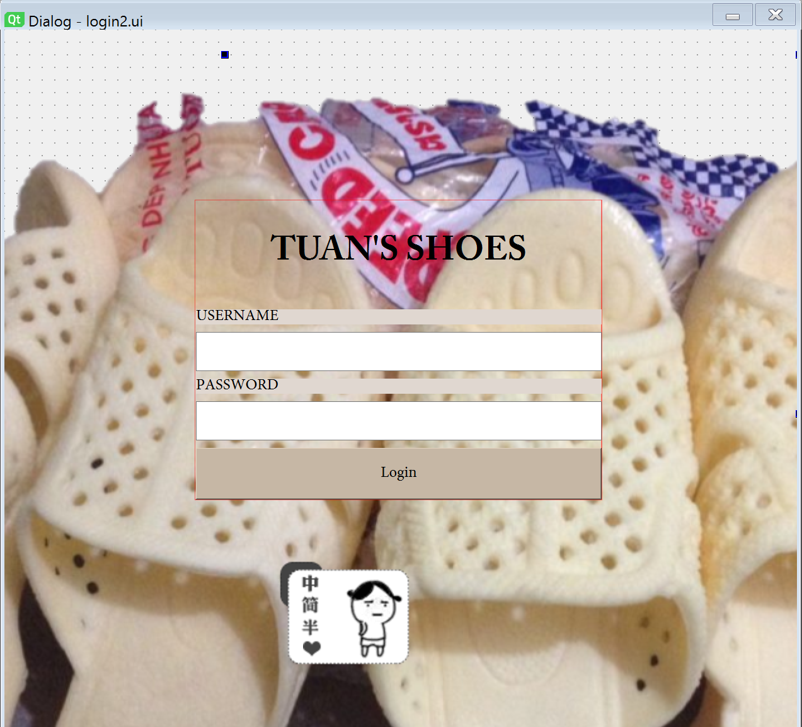
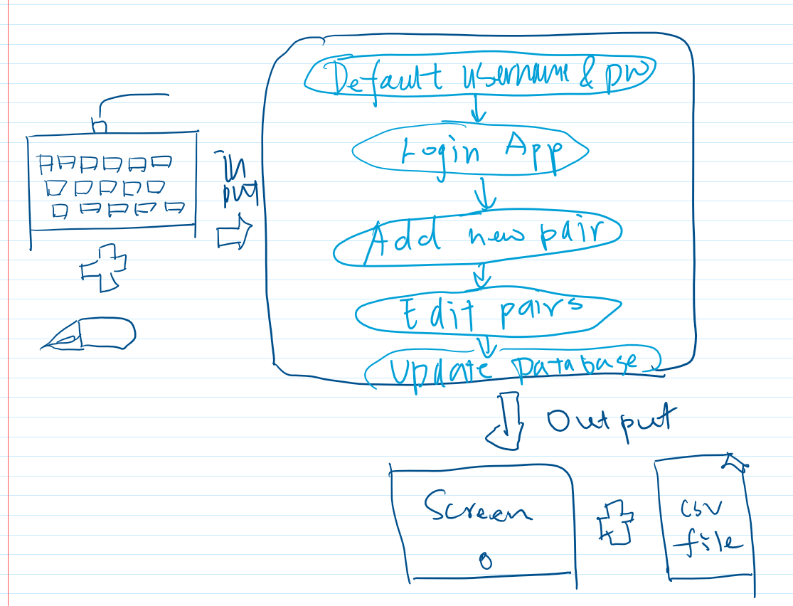
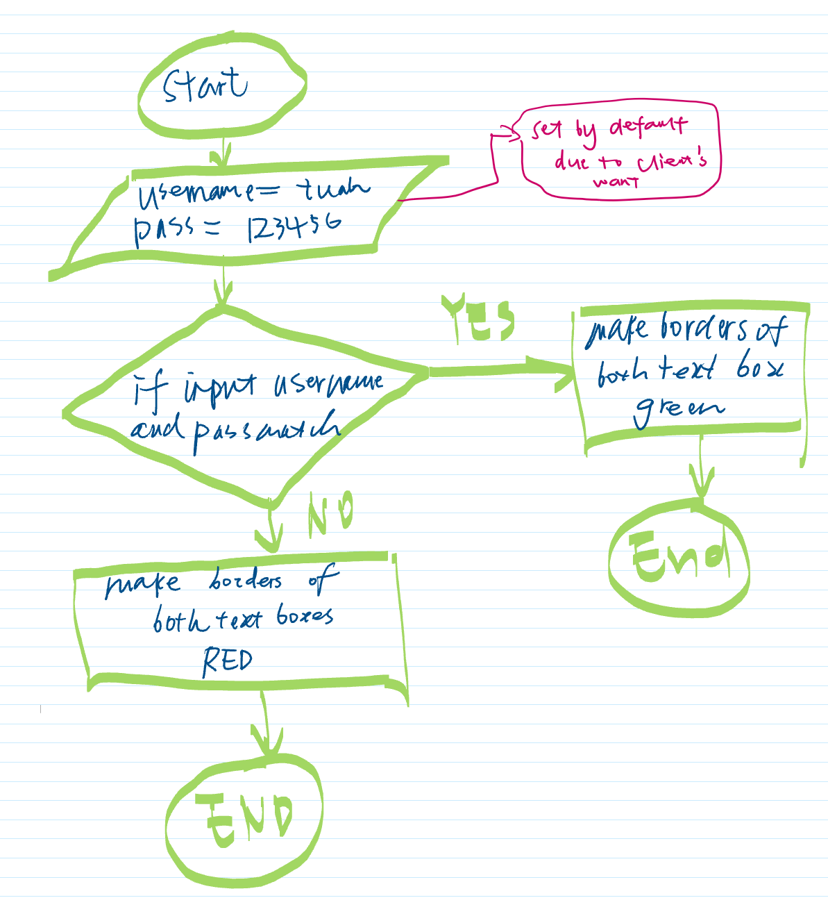
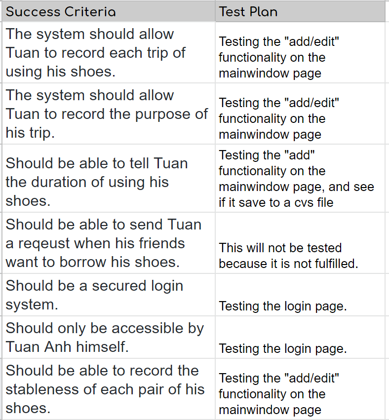

Criteria B: Designing
===

## 1. System sketch 1.0

[Fig1] System sketch made on Feb.25th

**Explaination of the sketch**: The idea is to have a "shoe-directed" system that allows Tuan to start from one of the pairs to decide upon 
specific actions he wants to choose: either to lend out, record trips, or to record its situations. From their, different functionalities and
possibilities are enabled for further actions.

## 2. GUI designing

[Fig 2] User interface designed via QT designer

[Fig 3] User interface designed via QT designer

**Explaination of the user interface**: The idea completely follows the sketch idea

**Tuan's feedback:**

  After the third meeting with Tuan, I collected his feedback as below:
  1. the "shoe-directed" idea is great. However, he would like to be able to add new pairs of shoes, which requires the 
  interface to be more clear and not having each pair displayed individually.
  
  1. The "lend-out" system should be able to send an email to his friend.
  
  1. Recording can be found [here](https://github.com/LingyeWU/unit3/blob/master/Appendix.md)

## 3. GUI designing 2.0

[Fig 4, 5] Newest desgin for the User Interface

Given that the initial idea was good but way too complicated in programming - it requires each shoe to connect its own mainpage, I modified the
app into this format, with a clear and easy mianwindow including all basic functionalities.

## 4. System diagram

[Fig 6] System diagram for Tuan's shoe app

[Fig 7] The flow diagram for the login page. 

## 4. Testing plan

