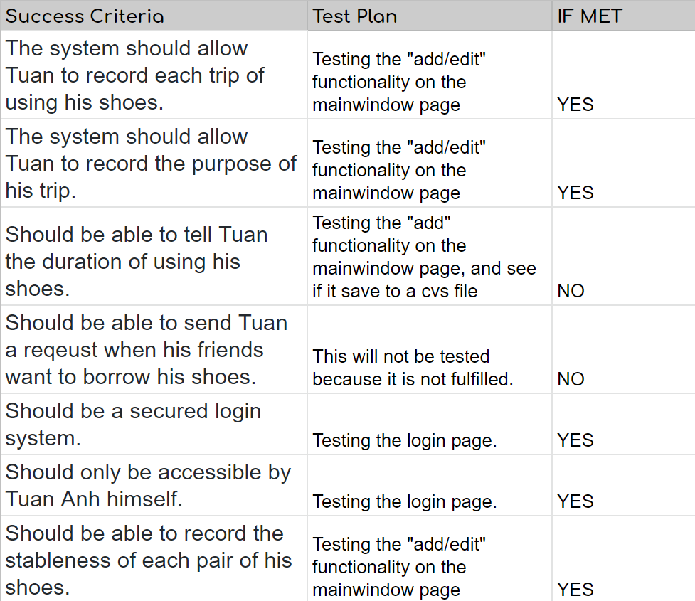

Criteria D: Evluation
===
### 1. Evaluation
Given the success criteria, the assessment is as following:

### 2. Possible improvements
- Some of the functionality is actually realizable such as to calculate the duration of each pair of schoes Tuan has wore.
- The interface does not resize with the size of the widget.
- The functionality of sending an email to a friend when they want to borrow Tuan's shoes require a register system and a "email auto sending"
system, which can be devloped in the future.
- The interface can definitely be designed more user firendly and aesthetically beautiful.
- The application is lacking a feedback system from the client.

### 3. Video summary
The video summary to the project can be accessed [here](https://www.youtube.com/watch?v=m4U5R6QGf5o).
